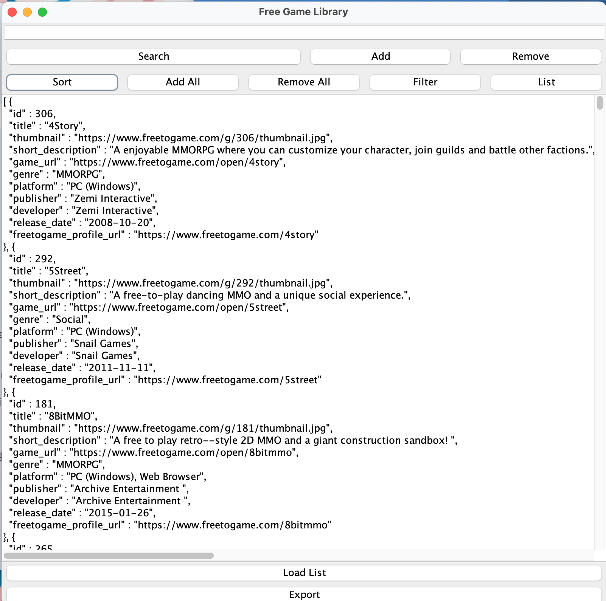

# GUI Test Report

## Overview
This report outlines the results of the GUI tests conducted on the application. Each test case includes a description, the steps taken, the expected outcome, the actual outcome, and any relevant screenshots.

## Test 1: search button
Steps:
1. Type in the game name.
2. Locate the button labeled "search".
3. Click the button.
Expected Outcome: If the game name exists, display the info of the game. If the game does not exist, display "no game found". (not case sensitive)
Actual Outcome: Same as expected.
Status: Passed
Screenshots if game exists:

Screenshots if game does not exist:

## Test 2: filter button
Steps:
1. Click the button.
2. Select the filter parameter.
3. Select a filter type.
4. Type in the filter feature.
5. Click Ok.
Expected Outcome: Display the filtered result. If filtered result is null, display an empty list [ ]. If click "cancel", display "filter incomplete". If filter parameter is a numeric value, filter type compare the numeric value. If parameter is a string, it will be in alphabetical order.
Actual Outcome: Same as expected.
Status: Passed

Screenshots when filter canceled:

Result of different filter parameters:
Screenshots when the filter parameter is "id", filter type is "==", feature is "1"。

Screenshots when the filter parameter is "title", filter type is "==", feature is "Overwatch 2"。

Screenshots when the filter parameter is "thumbnail", filter type is "==", feature is "https://www.freetogame.com/g/292/thumbnail.jpg"。

Screenshots when the filter parameter is "short description", filter type is "==", feature is "Take the battle royale genre and add  mystical powers and you have CRSED: F.O.A.D. (Aka Cuisine Royale: Second Edition)"。

Screenshots when the filter parameter is "game url", filter type is "==", feature is "https://www.freetogame.com/open/second-life"。

Screenshots when the filter parameter is "genre", filter type is "==", feature is "social"。

Screenshots when the filter parameter is "platform", filter type is "==", feature is "pc (windows)"。

Screenshots when the filter parameter is "publisher", filter type is "==", feature is "snail games"。

Screenshots when the filter parameter is "developer", filter type is "==", feature is "SEGA"。

Screenshots when the filter parameter is "date", filter type is "==", feature is "2022-10-18"。

Result of different filter type:

Screenshots when the filter parameter is "date", filter type is "==", feature is "2022-10-18"。

Screenshots when the filter parameter is "date", filter type is "~=", feature is "2022"。It display all games in 2022.

Screenshots when the filter parameter is "date", filter type is "!=", feature is "2022-01-12"。

Screenshots when the filter parameter is "date", filter type is ">", feature is "2024-06-22"。

Screenshots when the filter parameter is "date", filter type is ">=", feature is "2024-06-22"。

Screenshots when the filter parameter is "date", filter type is "<", feature is "2001-01-04"。

Screenshots when the filter parameter is "date", filter type is "<=", feature is "2001-01-04"。

Screenshots when the filter parameter is "title", filter type is "==", feature is "overwatch 2"。

Screenshots when the filter parameter is "title", filter type is "~=", feature is "world"。

Screenshots when the filter parameter is "title", filter type is "!=", feature is "overwatch 2"。

Screenshots when the filter parameter is "title", filter type is ">", feature is "XDefiant"。

Screenshots when the filter parameter is "title", filter type is ">=", feature is "zula"。

Screenshots when the filter parameter is "title", filter type is "<", feature is "A.V.A Global"。

Screenshots when the filter parameter is "title", filter type is "<=", feature is "A.V.A Global"。

## Test 3: add/remove/list button
Steps for add button:
1. Locate the button labeled "add".
2. Click the button.
3. Click OK.
4. Locate the button labeled "list".
5. Click the button and choose the format to display.
Expected Outcome: When click the list, display the game added.
Actual Outcome: Same as expected.
Status: Passed

Screenshots of adding "Overwatch 2" and choose json as display format.

Screenshots of adding "Overwatch 2" and choose csv as display format.

Screenshots of adding "Overwatch 2" and choose xml as display format.

Screenshots of adding "Overwatch 2" and choose pretty as display format.

Steps for remove button:
1. Locate the button labeled "remove".
2. Click the button.
3. Click OK.
4. Locate the button labeled "list".
5. Click the button and choose the format to display.
Expected Outcome: When click the list, display the game not removed.
Actual Outcome: Same as expected.
Status: Passed
Screenshots of removing "Overwatch 2" from the list.

## Test 4: Add all/Remove all button
Steps for Add All button:
1. filtered the game.
2. Locate the button labeled "Add All"
3. Click the button.
Expected Outcome: If added successfully, it will display "Done".
Actual Outcome: Same as expected.
Status: Passed

Screenshot when filtered id<=2 and clicked add all.

Screenshot when filtered id<=2, clicked add all, and click list.

Steps for Remove All button:
1. Locate the button labeled "Remove All"
2. Click the button.
Expected Outcome: If added successfully, it will display "Removed All Games from Main List". If the game list is already empty, it will display "Games List is already empty".
Actual Outcome: Same as expected.
Status: Passed

Screenshot when clicked removed all and the game list is not empty.

Screenshot when clicked removed all but the game list is already empty.

## Test 5: Sort button
Steps:
1. Locate the button labeled "sort" and click.
2. Select the sort parameter
3. Select a sort type
4. Click Ok.
Expected Outcome: Display the orderd result. If click "cancel", display "Sort Option is null". If sort parameter is a numeric value, it will be sorted by the numeric value. If parameter is a string, it will be in alphabetical order.
Actual Outcome: Same as expected.
Status: Passed

Screenshot when sort canceled:

Result of different sort parameters:

Screenshots when the sort parameter is "id", filter type is "ascending".

Screenshots when the sort parameter is "id", filter type is "descending".

Screenshots when the sort parameter is "title", filter type is "ascending".

Screenshots when the sort parameter is "title", filter type is "descending".

Screenshots when the sort parameter is "genre", filter type is "ascending".

Screenshots when the sort parameter is "genre", filter type is "descending".

Screenshots when the sort parameter is "publisher", filter type is "ascending".

Screenshots when the sort parameter is "publisher", filter type is "descending".

Screenshots when the sort parameter is "developer", filter type is "ascending".

Screenshots when the sort parameter is "developer", filter type is "descending".

Screenshots when the sort parameter is "release_date", filter type is "ascending".

Screenshots when the sort parameter is "release_date", filter type is "descending".

## Test 5: Load button
Steps:
1. Locate the button labeled "Load List" and click.
2. Select the file format
3. Select the databse file.
Expected Outcome: If the file is load successfully, it will display the file when click list.
Actual Outcome: Same as expected.
Status: Passed

Screenshots:

## Test 6: Export button
Steps:
1. Locate the button labeled "export" and click.
2. Select the file format
3. Type in a valid file name and choose the file path.
4. Click Save
Expected Outcome: If the file is saved successfully, it will pop a window and report "Export Success". The file will be saved in the selected path.
Actual Outcome: Same as expected.
Status: Passed

Screenshots:

